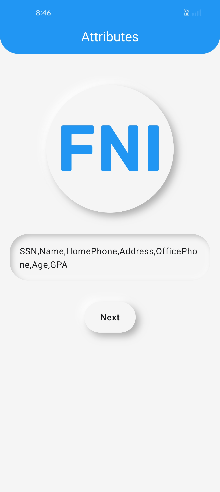
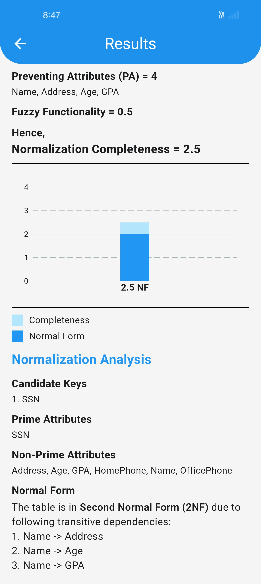
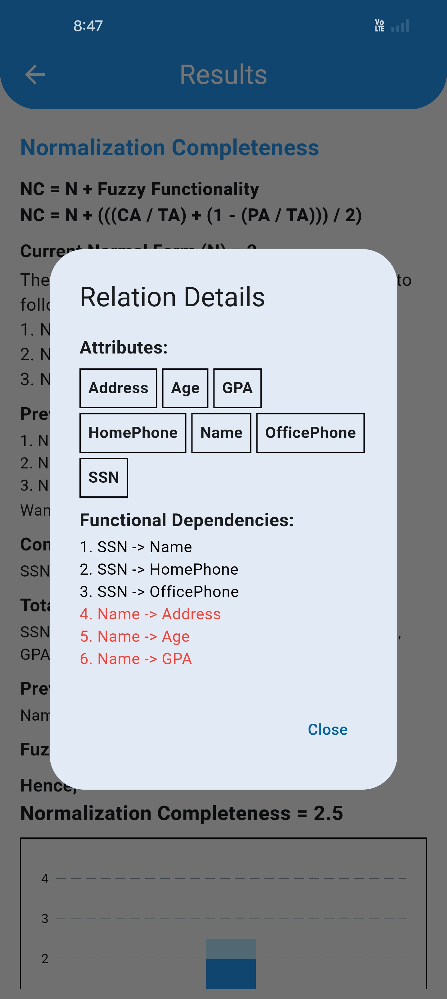

# Fuzzy Normalization Index


The Fuzzy Normalization Index introduces an enhanced approach to database normalization, guiding users through the process up to Boyce-Codd Normal Form (BCNF). It combines the traditional normalization process with fuzzy functionality to provide a quantitative measure of normalization completeness.

The project evaluates functional dependencies, identifies the current normal form, and calculates the degree of completeness using attributes such as completeness attributes, preventing attributes, and total attributes. This additional layer of detail helps users understand how close a schema is to achieving the next normal form and highlights areas for improvement.

This software is designed to provide a more comprehensive understanding of database normalization for software engineers, researchers, and database designers, enhancing their ability to optimize database schemas effectively.

## Screenshots

| Splash Screen | Attributes Screen | Functional Dependencies Screen |
|--------------|------------------|------------------------------|
|  |  |  |
| Results Screen | Results Screen (Remaining) | Relation Details Dialog |
|  |  |  |

## Development Environment

- Flutter SDK: 3.19.5
- Dart SDK: 3.3.3
- Android SDK: 34.0.0
- VS Code: 1.98.0
- Gradle: 7.6.3
- Java JDK: 21.0.1

### Android Compatibility
- **Minimum SDK Version**: 21 (Android 5.0 Lollipop)
- **Target SDK Version**: 34 (Android 14)

## Setup & Installation

### Clone the repository:
```sh
git clone https://github.com/Ahmad-Yezdan/fni.git
cd fni
```
### Install dependencies:
```sh
flutter pub get
```
### Run the app:
```sh
flutter run
```


## License

[](LICENSE)